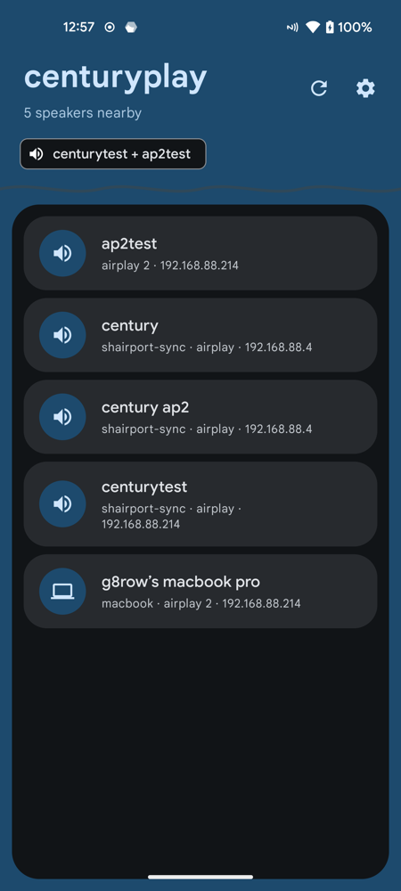
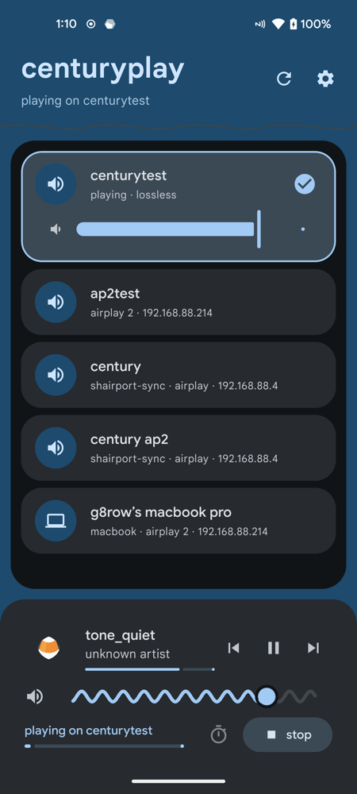
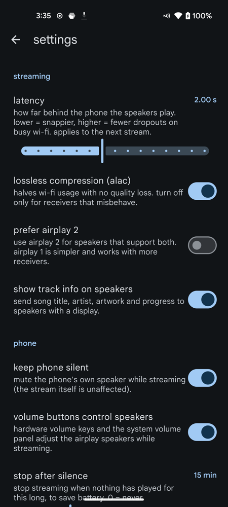

# centuryplay

stream audio from your android device to airplay speakers.


[](https://github.com/g8row/centuryplay/actions/workflows/build.yml)

<div align="center">
  
  
  
</div>

<div align="center">
  <p><i>main interface • active streaming • settings</i></p>
</div>

## the story

started as a way to breathe new life into a bang & olufsen beosound century - a beautiful 1990s hi-fi system with stunning sound quality but no wireless capabilities. by adding a raspberry pi running [shairport-sync](https://github.com/mikebrady/shairport-sync), the century can now receive airplay streams.

centuryplay completes the chain by letting android devices stream system audio to shairport-sync (or any airplay receiver), effectively turning a vintage b&o system into a modern wireless speaker.

## features

- **one tap to play**: tap a speaker and your phone's audio plays there. tap more speakers for multi-room, each with its own volume.
- **in the system output switcher**: your airplay speakers show up in the media controls' output picker of any app, next to bluetooth devices.
- **volume buttons control the speakers**, and the system volume panel slider follows them.
- **phone stays silent** while streaming.
- **auto-play on my speakers** (optional): music starts at home → it plays on your usual speakers by itself.
- **quick settings tile, home-screen widget, launcher shortcuts, sleep timer.**
- **lossless alac** (apple's own encoder), resend of lost packets, drift-free sync, automatic reconnect.
- **track info and artwork** on speakers that have a display.
- **airplay 1 and airplay 2**: transient pairing (homepod, sonos, macs) and one-time **pairing with a code** (apple tv, password-protected speakers) that's remembered.
- **remote control from the speaker side** (dacp): receiver remotes can play/pause/skip and change volume.
- **recent groups**: one tap brings back "living room + kitchen".
- **per-speaker audio delay** to line up speakers or match video, and an option to keep game sounds on the phone.
- **optional shizuku mode**: one-tap setup that removes every permission prompt and bypasses the phone speaker completely.

## lossless & hi-res audio

### does it work with apple music?

no — apple music on android only allows its audio to be captured by the system itself, and android restricts that
kind of capture to 16 khz mono. most other apps (e.g. spotify, youtube music, vlc, podcast apps, browsers) work; the app tells you when one blocks capture.

### android audio resampling

| source | android behavior | stream output |
|--------|------------------|---------------|
| 44.1 khz (cd quality) | no resampling | bit-perfect |
| 48 khz | native | bit-perfect |
| 96 khz hi-res | resampled to 48 khz | downsampled |
| 192 khz hi-res | resampled to 48 khz | downsampled |

key points:
- android's mixer typically runs at 48 khz.
- hi-res content is downsampled by android before reaching this app.
- airplay streams 16-bit/44.1 khz, so additional resampling may occur.
- audio is sent as alac (lossless compression), so nothing is lost on the way to the speaker.
- for true bit-perfect playback, exclusive usb audio mode would be required.

bottom line: excellent quality, but not bit-perfect hi-res. cd quality (16-bit/44.1khz) is handled cleanly.

## supported protocols

| protocol | status | notes |
|----------|--------|-------|
| airplay 1 (raop) | working | alac or l16, optional aes, resends, metadata, passwords |
| airplay 2 (realtime) | working | transient pairing (pin 3939), ntp timing, alac; no fairplay needed |
| fairplay-only receivers | unsupported | e.g. airscreen (`et=5` without `et=1`) |

## requirements

- android 11 (api 30) or higher. android 13+ for shizuku capture.
- airplay-compatible receiver (e.g. shairport-sync, airport express, homepod, apple tv, sonos, macs).
- optional: [shizuku](https://shizuku.rikka.app/) for the no-prompt, silent-phone experience.

## installation

### from source

1. clone the repository:
   ```bash
   git clone https://github.com/g8row/centuryplay.git
   cd centuryplay
   ```

2. build with gradle:
   ```bash
   JAVA_HOME=/path/to/jdk17 ./gradlew assembleDebug   # needs the android ndk (alac encoder)
   ```

3. install the apk:
   ```bash
   adb install app/build/outputs/apk/debug/app-debug.apk
   ```

### from release

download `centuryplay-v2.0.apk` from the [latest release](https://github.com/g8row/centuryplay/releases/latest). it installs over v1.x.
every push to master also builds a debug apk (actions → build → artifacts).

## usage

1. open centuryplay and tap a speaker. that's it — tap more speakers to add them, tap again to remove.
2. the first time, android asks to allow audio capture (skipped entirely with shizuku).
3. from then on you can also use the media controls' output picker, the quick settings tile, the widget or the volume buttons.

### shizuku (recommended)

install and start [shizuku](https://shizuku.rikka.app/), then tap "set up" on the card in centuryplay. it grants, once:
the screen-capture approval (no more prompt), notification access (track info), battery exemption, and lets centuryplay
*reroute* media audio instead of copying it — the phone speaker is bypassed and nothing shows the "casting" indicator.

## how it works

uses android's `audioplaybackcapture` api to capture system audio, then streams it to airplay receivers using raop (remote audio output protocol).

```
┌─────────────┐     ┌──────────────┐     ┌────────────────┐
│   android   │────▶│  airplay     │────▶│   airplay      │
│   device    │     │  streamer    │     │   receiver     │
│  (audio)    │ pcm │  (this app)  │ rtp │  (speaker)     │
└─────────────┘     └──────────────┘     └────────────────┘
```

### technical details

- capture: mediaprojection playback capture, or an audiopolicy loopback mix via shizuku (shell user).
- audio: alac (apple's reference encoder via jni) or l16, 352 frames per packet, 44.1 khz stereo.
- transport: rtp over udp; rtsp control; lost packets resent from an ~8 s backlog.
- timing: ntp-style timing + sync packets derived from the capture clock (no drift), shared by all speakers (multi-room).
- airplay 2: hap transient pairing (srp-6a), chacha20-poly1305 audio and control channels.
- discovery: android's own mdns (nsdmanager).

see [docs/RESEARCH_AND_ROADMAP.md](docs/RESEARCH_AND_ROADMAP.md) for design notes, verified findings and the roadmap, and
see [docs/airplay_protocol.md](docs/AIRPLAY_PROTOCOL.md) for detailed protocol documentation.

## tested receivers

| receiver | protocol | status | notes |
|----------|----------|--------|-------|
| shairport-sync 4.x (airplay 1 build) | airplay 1 | verified | alac, metadata, multi-room |
| shairport-sync 4.x (airplay 2 build) | airplay 1 | verified | its airplay 2 mode is ptp-only, so centuryplay uses its airplay 1 endpoint |
| macos airplay receiver | airplay 2 | connects | the mac asks to accept each new sender (15 s) |
| airport express | airplay 1 | expected to work | |
| homepod / apple tv (transient pairing) | airplay 2 | expected to work | pyatv-compatible path |
| sonos / ikea symfonisk | airplay 2 | expected to work | owntone-compatible alac path; reports welcome |
| airscreen / samsung | raop + fairplay | unsupported | requires fairplay sapv2 (`et=5`) sender crypto |

## limitations

- some apps block audio capture (netflix, apple music on android) — centuryplay tells you when that happens.
- latency: ~2 s by default (adjustable 0.5–4 s); use the per-speaker audio delay to line up speakers or video.
- fairplay-only receivers can't be supported.

## changelog

### v2.0 (september 2026)
- new streaming engine: alac, resends, drift-free sync, multi-room, auto-reconnect, metadata + artwork.
- airplay 2 (transient pairing) with automatic fallback to airplay 1.
- system integration: output switcher entries for any app, volume buttons, media notification, tile, widget, shortcuts, auto-play.
- shizuku: one-tap setup and silent-phone capture.
- discovery via android nsd (fixes the android 17 crash) with self-healing, sleep timer, per-speaker delay, redesigned ui.
- airplay 2 pairing with a code (pair-setup + pair-verify, remembered), dacp remote control, recent groups,
  "stream game sounds" toggle, the consent dialog asks for the whole screen directly (android 14+).

### v1.0 (january 2026)
- music player integration: real-time metadata (title, artist, art) and controls.
- ui polish: minimal aesthetics, lowercase typography, neutral status indicators.
- settings: keep screen on, auto-connect, and layout fixes.
- technical: project configuration updated for stable release.

### v0.2 (january 2026)
- wavy volume slider.
- material 3 theming.
- connection monitoring.
- crash fixes.

### v0.1 (december 2025)
- initial release.
- airplay 1 (raop) support.
- mdns device discovery.
- encrypted audio streaming.

## development

see [development.md](DEVELOPMENT.md) for notes.

### tech stack

- language: kotlin
- ui: android views (viewbinding)
- architecture: mvvm + stateflow
- concurrency: coroutines + flow
- networking: raw sockets, nsdmanager (jmdns fallback)
- audio: apple alac encoder (ndk/jni)
- crypto: bouncycastle, platform chacha20-poly1305
- optional: shizuku api

## contributing

contributions welcome. submit a pull request.

## license

gnu agpl v3. see [license](LICENSE). bundled apple alac codec: apache 2.0 (app/src/main/cpp/alac).

## acknowledgments

- [shairport-sync](https://github.com/mikebrady/shairport-sync)
- [pyatv](https://github.com/postlund/pyatv) and [owntone](https://github.com/owntone/owntone-server) (airplay 2 reference)
- [apple alac](https://github.com/macosforge/alac) (apache 2.0)
- [scrcpy](https://github.com/Genymobile/scrcpy) (audio policy capture technique) and [shizuku](https://github.com/RikkaApps/Shizuku)
- [unofficial airplay protocol spec](https://nto.github.io/AirPlay.html)

---

disclaimer: airplay is a trademark of apple inc. this project is not affiliated with apple inc.
